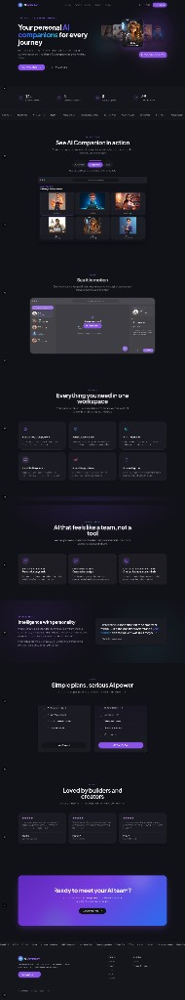
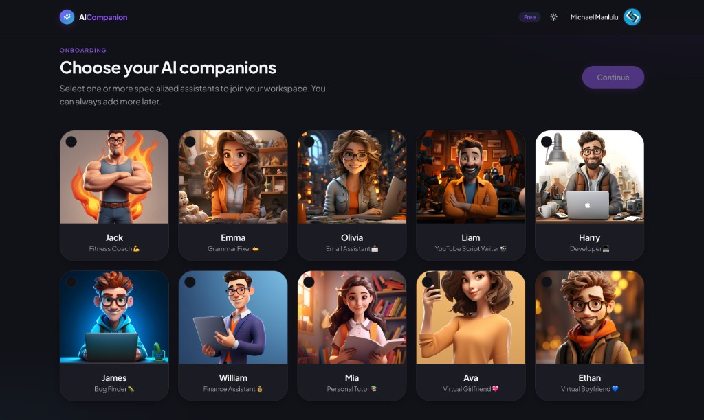
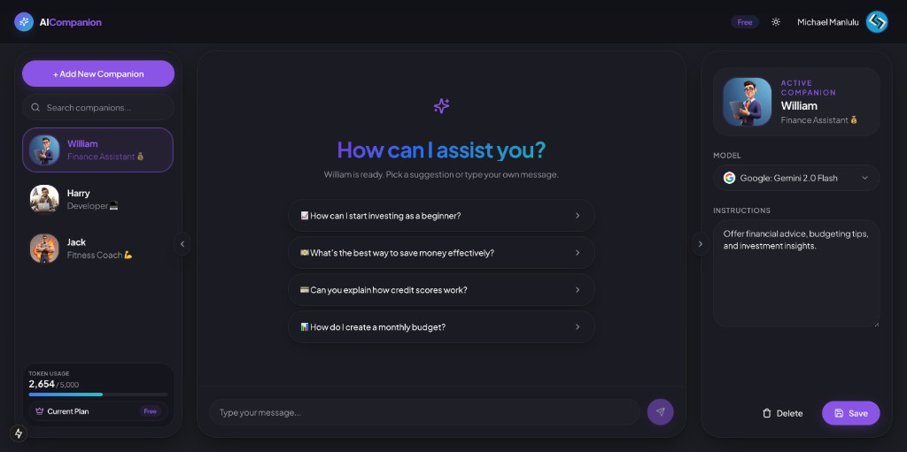
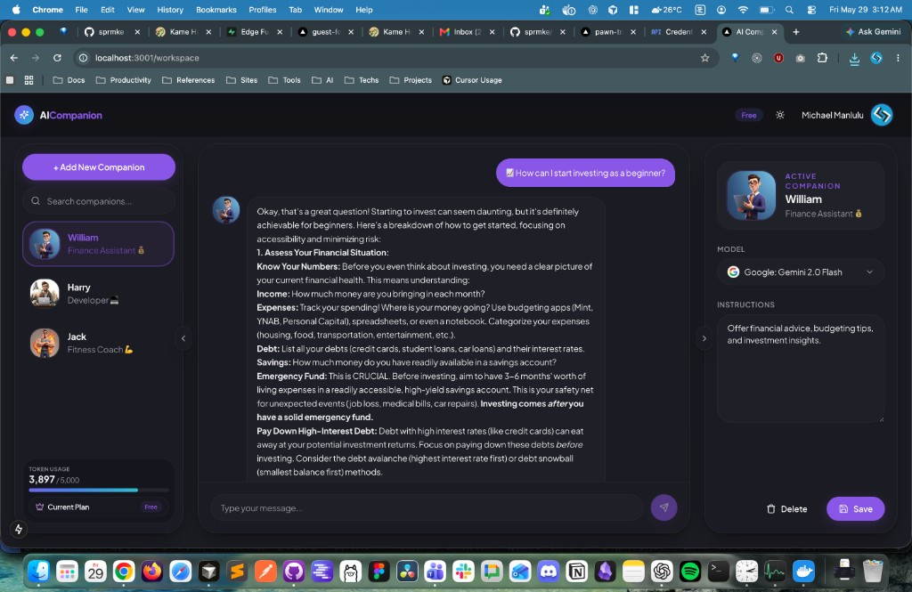
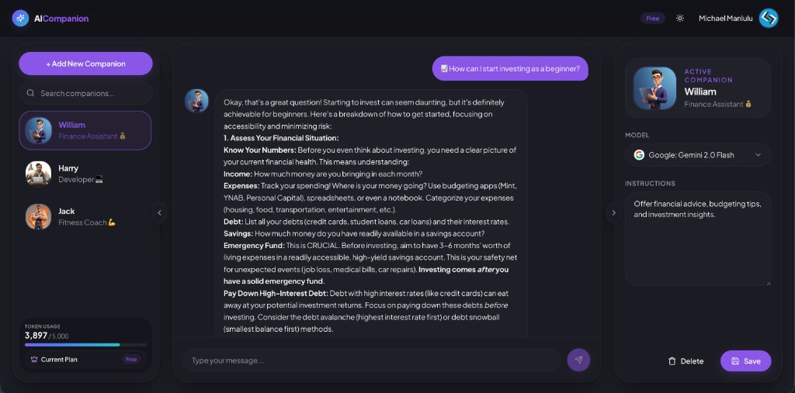
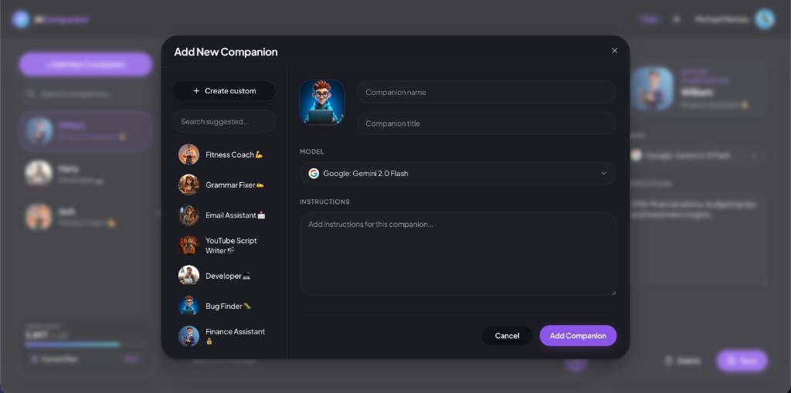
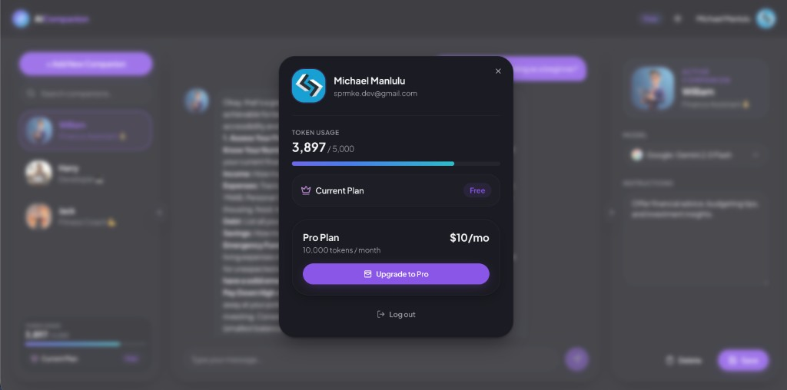
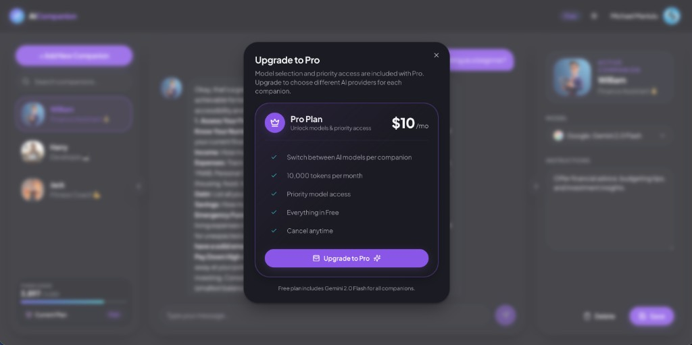

# AI Companion

**A modern web app for building a personal team of AI assistants — each with its own personality, instructions, and workspace.**

Pick curated companions (fitness coach, code writer, tutor, and more) or create your own from scratch. Chat in a polished three-panel workspace, track token usage, and upgrade to Pro via Stripe. Built with **Next.js 15**, **Convex**, **Google sign-in**, and **Eden AI** for multi-model chat.

<p align="center">
  
</p>

<p align="center">
  <a href="#features">Features</a> ·
  <a href="#screenshots">Screenshots</a> ·
  <a href="#tech-stack">Tech Stack</a> ·
  <a href="#getting-started">Getting Started</a>
</p>

<p align="center">
  
  
  
  
  
  
  
  
  
</p>

---

## Features

### AI companions

- **12+ curated personas** — fitness coach, grammar fixer, email writer, code writer, tutor, and more
- **Custom companions** — name, title, avatar, and instructions
- **Onboarding flow** — multi-select companions when you first sign in
- **Per-companion settings** — model selection and instruction editing (UI ready; some fields gated in current build)

### Workspace

- **Three-panel layout** (desktop): companion list · chat · settings
- **Mobile shell** with bottom navigation — Companions, Chat, Settings
- **Markdown chat** with suggestion chips on empty state
- **Search** companions by name or title
- Active companion highlight with gradient nav styling

### AI & models

- Chat powered by **[Eden AI](https://www.edenai.co/)** (`/api/eden-ai-model`)
- Model options include **Gemini 2.0 Flash**, **GPT-4o mini**, **GPT-3.5 Turbo**, **Mistral**, and **Claude 3.5 Haiku**
- Token usage deducted from user credits per assistant reply

### Authentication & billing

- **Sign in with Google** via `@react-oauth/google` — access token stored in `localStorage`
- User records in **Convex** (`users`, `userAiAssistants`)
- **Free plan:** 5,000 tokens · **Pro plan:** 10,000 tokens ($10/month via Stripe Checkout)
- Stripe webhooks update credits and subscription state
- Profile modal: usage progress bar, upgrade, cancel subscription

### Marketing site

- Full **landing page**: hero, stats, product tour, video demo, features, dark section, philosophy, pricing, testimonials, CTA
- Scroll-reveal animations, mesh gradients, and violet/cyan design system
- **Light / dark mode** via `next-themes`
- Public `/` route — app routes require sign-in

---

## Screenshots

|                         Landing                          |                    Companions onboarding                    |
| :------------------------------------------------------: | :---------------------------------------------------------: |
|  |  |

### Workspace

|                Empty chat state                |                      Active conversation                       |
| :--------------------------------------------: | :------------------------------------------------------------: |
|  |  |

|        Chat with suggestions         |
| :----------------------------------: |
|  |

### Modals

|                       Add companion                        |                Profile & billing                 |                   Upgrade to Pro                   |
| :--------------------------------------------------------: | :----------------------------------------------: | :------------------------------------------------: |
|  |  |  |

---

## Tech Stack

| Layer              | Technology                                                                                                                 |
| ------------------ | -------------------------------------------------------------------------------------------------------------------------- |
| Framework          | [Next.js 15](https://nextjs.org/) (App Router)                                                                             |
| UI                 | [React 18](https://react.dev/), [Tailwind CSS 3](https://tailwindcss.com/), [shadcn/ui](https://ui.shadcn.com/) (New York) |
| Motion             | [Motion](https://motion.dev/) (Framer Motion successor) + custom CSS animations                                            |
| Typography         | [Plus Jakarta Sans](https://fonts.google.com/specimen/Plus+Jakarta+Sans)                                                   |
| **Backend / DB**   | [Convex](https://www.convex.dev/) (real-time queries & mutations)                                                          |
| **Authentication** | [Google OAuth](https://developers.google.com/identity) (`@react-oauth/google`)                                             |
| **AI**             | [Eden AI](https://www.edenai.co/) unified API                                                                              |
| **Payments**       | [Stripe](https://stripe.com/) Checkout + webhooks                                                                          |
| **Hosting**        | [Vercel](https://vercel.com/) (recommended)                                                                                |
| Toasts             | [Sonner](https://sonner.emilkowal.ski/)                                                                                    |
| Markdown           | `react-markdown`                                                                                                           |

---

## Getting Started

### Prerequisites

- Node.js 20+ (or [Bun](https://bun.sh))
- A [Convex](https://www.convex.dev/) project
- [Google Cloud](https://console.cloud.google.com/) OAuth 2.0 **Web application** credentials
- [Eden AI](https://www.edenai.co/) API key
- [Stripe](https://stripe.com/) account (for Pro subscriptions — optional for local chat testing if credits are seeded manually)

### 1. Clone and install

```bash
git clone https://github.com/sprmke/ai-personal-assistant-app.git
cd ai-personal-assistant-app
npm install   # or: bun install
```

### 2. Environment variables

```bash
cp env.example .env.local
```

Fill in:

| Variable                       | Description                              |
| ------------------------------ | ---------------------------------------- |
| `NEXT_PUBLIC_CONVEX_URL`       | Convex deployment URL from the dashboard |
| `NEXT_PUBLIC_GOOGLE_CLIENT_ID` | Google OAuth client ID (Web)             |
| `EDEN_AI_API_KEY`              | Eden AI bearer token for chat API        |
| `STRIPE_SECRET_KEY`            | Stripe secret key (server)               |
| `STRIPE_WEBHOOK_SECRET`        | Stripe webhook signing secret            |
| `NEXT_PUBLIC_STRIPE_PRICE_ID`  | Stripe Price ID for the Pro plan         |

See [`env.example`](./env.example) for the full list.

**Google OAuth setup**

1. Create OAuth credentials (Web application) in Google Cloud Console.
2. Add authorized JavaScript origins: `http://localhost:3000` (and your production URL).
3. Paste the client ID into `NEXT_PUBLIC_GOOGLE_CLIENT_ID`.

**Stripe webhooks (production)**

Point a webhook to `/api/webhook` for checkout and subscription events. Use the Stripe CLI locally:

```bash
stripe listen --forward-to localhost:3000/api/webhook
```

### 3. Convex

In a separate terminal, run the Convex dev server (syncs schema and functions):

```bash
npx convex dev
```

This uses the project linked in `.env.local` / Convex dashboard. Schema lives in [`convex/schema.ts`](./convex/schema.ts).

### 4. Run locally

```bash
npm run dev
```

Open [http://localhost:3000](http://localhost:3000).

- **`/`** — public landing page
- **`/sign-in`** — Google sign-in
- **`/assistants`** — pick companions (after auth)
- **`/workspace`** — main chat dashboard

---

## Scripts

| Command            | Description                             |
| ------------------ | --------------------------------------- |
| `npm run dev`      | Next.js development server              |
| `npm run build`    | Production build                        |
| `npm run start`    | Start production server                 |
| `npm run lint`     | ESLint                                  |
| `npm run lint:fix` | ESLint with auto-fix                    |
| `npm run format`   | Prettier write                          |
| `npx convex dev`   | Convex dev sync (run alongside Next.js) |

---

## Project structure

```text
app/
  (auth)/sign-in/          # Google sign-in
  (main)/
    page.tsx               # Landing page
    assistants/            # Companion onboarding
    workspace/             # Chat dashboard + success redirect
  api/                     # Eden AI, Stripe, webhooks
components/
  landing/                 # Marketing sections
  ui/                      # shadcn primitives
  magicui/                 # Animated marketing components
  common/                  # Logo, theme toggle, loading screen
convex/                    # Schema, users, assistants mutations
context/                   # Auth & assistant React context
services/                  # Static companion & model lists
docs/screenshots/          # README portfolio images
public/                    # Logo, avatars, model icons
```

---

## Routes

| Route                | Access | Description            |
| -------------------- | ------ | ---------------------- |
| `/`                  | Public | Marketing landing      |
| `/sign-in`           | Public | Google OAuth           |
| `/assistants`        | Auth   | Select companions      |
| `/workspace`         | Auth   | Chat workspace         |
| `/workspace/success` | Auth   | Post-checkout redirect |

---

## Design

The UI follows a **violet / cyan AI brand** (Plus Jakarta Sans, large radii, elevated shadows, mesh gradients) — the same design language used across sibling portfolio projects. Tokens and utilities live in [`app/globals.css`](./app/globals.css).

---

## License

MIT — use as a portfolio reference with attribution.

---

<p align="center">
  Built for people who want AI that feels like a team — not a single generic chat box.
</p>
